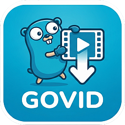
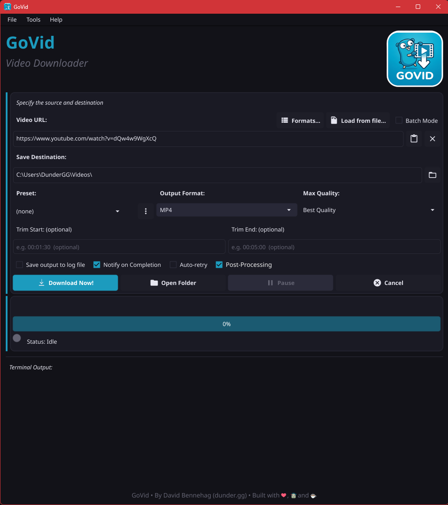

#  **GoVid**

Fast, cross-platform desktop video downloader, powered by `yt-dlp` with optional FFmpeg post-processing.

[](https://github.com/DunderGG/govid/releases/latest)
[](LICENSE)


[](https://github.com/DunderGG/govid/actions/workflows/ci.yml)

GoVid puts yt-dlp behind a native window: paste a link, pick a format and quality, and download, without touching the command line. It handles single videos, long batches, whole playlists, and live streams, and keeps its own tools up to date.

**[Download](https://github.com/DunderGG/govid/releases/latest)** · **[User Guide](docs/user-guide.md)** · [Building from source](#-building-from-source)

## ✨ Highlights

- **Any site yt-dlp supports**, saved as MP4, MKV, WebM, MP3, or M4A, at up to the resolution you choose. A format browser lets you pick the exact video and audio streams.
- **Batches and playlists**: paste many links or load a list, choose part of a playlist, and manage the queue while it runs. You can reorder, pause, resume, retry, and download up to three videos at once. Unfinished downloads resume after a restart.
- **Live streams**: record from now or from the start, or wait for a scheduled stream and record it when it begins.
- **Post-processing with FFmpeg**: smooth motion, sharpening, denoising, HDR to SDR, upscaling, audio normalization, and more, with optional GPU-accelerated encoding.
- **Complete files**: metadata, cover art, chapters, and subtitles written into each download, named the way you want.
- **Sign-in support** with cookies from your browser or a `cookies.txt` file, for age-restricted, members-only, and private videos.
- **Presets and settings files** to switch between setups or copy them to another computer.
- **Keeps itself working**: installs and updates yt-dlp, FFmpeg, and Deno, and updates GoVid itself, with every download checked against its published SHA-256 checksum.

The [User Guide](docs/user-guide.md) describes every feature and setting.

<p align="center">
  
</p>

## 📥 Download

Release builds are available for Windows.

1. Download the `.zip` from the **[latest release](https://github.com/DunderGG/govid/releases/latest)**.
2. Extract it to a folder you own. `yt-dlp` and `ffmpeg` are included in its `bin` folder.
3. Run `GoVid.exe`. On first start, GoVid offers to install anything missing, such as Deno, the JavaScript runtime YouTube downloads need.

On Linux, [build GoVid from source](#-building-from-source) and install `yt-dlp`, `ffmpeg`, and Deno or Node.js with your package manager.

## 🚀 Quick start

1. Paste a video or playlist URL into **Video URL**.
2. Choose an **Output Format** and **Max Quality**.
3. Choose where to save the file.
4. Click **Download Now!**

Press **F1** in GoVid for the built-in guide.

> **Downloads stopped working?** Sites change often, and an outdated `yt-dlp` is the most common cause. Use **Tools → Update yt-dlp**, or run `GoVid --update`. GoVid also checks for a newer `yt-dlp` once a day.

## ⚙️ Configuration

Most settings are in **Tools → Preferences** and **Tools → Post-Processing**. Every setting can also be saved to a JSON file and loaded again, to set up another computer or to keep several setups. Use **Tools → Export settings…** and **Tools → Import settings…**, or put a `govid.json` beside `GoVid.exe` and click **Load from Config** in Preferences. A file only needs the settings you want to change:

```json
{
  "path": "C:\\Downloads\\YouTube",
  "format": "MP4",
  "quality": "1080p"
}
```

See [Configuration files](docs/user-guide.md#configuration-files-govidjson) in the User Guide for every key and value.

## 🔨 Building from source

You need:

- [Go 1.26.1 or later](https://go.dev/dl/).
- A GCC C compiler, because the [Fyne](https://fyne.io/) toolkit uses CGO.
  - **Windows**: install [MSYS2](https://www.msys2.org/), run `pacman -S mingw-w64-x86_64-gcc` in its shell, and add `C:\msys64\mingw64\bin` to `PATH`. Also install [go-winres](https://github.com/tc-hib/go-winres), which embeds the app icon.
  - **Debian/Ubuntu**: `sudo apt install gcc libgl1-mesa-dev xorg-dev`.
- At run time: [yt-dlp](https://github.com/yt-dlp/yt-dlp), [FFmpeg](https://ffmpeg.org/), and a JavaScript runtime ([Deno](https://deno.com/) 2.3 or newer, or Node.js 22 or newer), on `PATH` or in a `bin` folder beside the executable.

Then build:

```bash
git clone https://github.com/DunderGG/govid.git
cd govid
./build.sh      # Linux
.\build.bat     # Windows
```

This produces `GoVid` or `GoVid.exe` in the repository folder. [CONTRIBUTING.md](CONTRIBUTING.md) covers tests, versioning, and packaging.

## 🧱 Built With

- [Fyne](https://fyne.io/): cross-platform GUI toolkit for Go
- [yt-dlp](https://github.com/yt-dlp/yt-dlp): the download engine
- [FFmpeg](https://ffmpeg.org/): merging, conversion, and post-processing

## 🤝 Contributing

Bug reports and pull requests are welcome. For a bug report, **Help → Copy diagnostics** collects the details needed. See [CONTRIBUTING.md](CONTRIBUTING.md) for the development setup and workflow.

## 👤 Author

**David Bennehag** - [@DunderGG](https://github.com/DunderGG) - [dunder.gg](https://dunder.gg)

## 📄 License

This project is licensed under the GPL-3.0. See the [LICENSE](LICENSE) file for details.

## ⚖️ Responsible use

Use GoVid for videos you are allowed to keep, such as your own uploads, freely licensed videos, or videos a site lets you download. Respect copyright and each site's terms of service: you are responsible for what you download and how you use it. GoVid is not affiliated with YouTube or any other site it downloads from.
